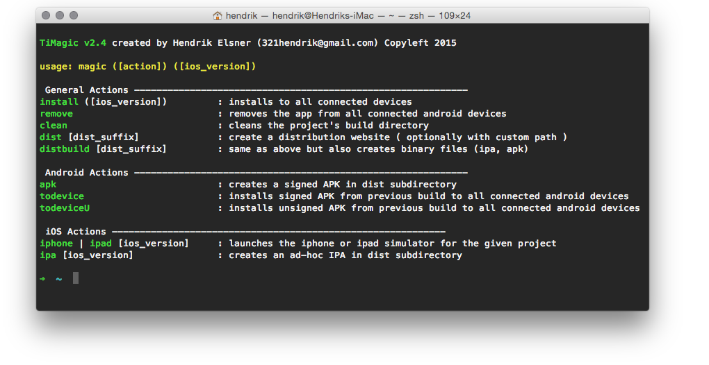

# TiMagic (NodeJS)
  
Command-line tool for the Titanium CLI and ADB, which bundles the following features:

* Build and install in parallel to all connected android devices and genymotion or run in iOS simulator.
* Quickly install prebuild apps to all connected android devices.
* All build related information is pulled from a one-time config file (xml) and the project's tiapp.xml.
* Use your favourite IDE for app development without sacrificing easy and fast access to Titanium CLI features.
* Distribute your app to iOS and android devices using a generated microsite (beta feature)

### Get TiMagic
1. Clone the repository to a local folder.
1. Setup your paths and configuration in timagic_settings_empty.json and rename it to timagic_settings.json
1. Simlink the files to a folder in your PATH
(Assuming you're on the repository's root folder and `~/bin` is in your PATH) run:  
```ln timagic ~/bin/timagic;ln timagic_settings.json ~/bin/timagic_settings.json;chmod +x ~/bin/timagic```

### Use TiMagic
Run `timagic help` from your app projects directory for usage information.

### General Requirements
* Currently only tested on MacOS
* [Appcelerator Titanium CLI](https://github.com/appcelerator/titanium) <= 3.2
* ADB 1.0.* (As part of Appcelerator Titanium)