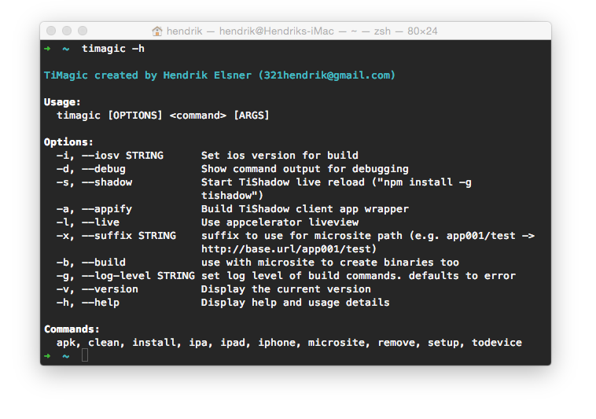

# TiMagic  
[](http://badge.fury.io/js/timagic) [](https://gitter.im/hendrikelsner/timagic?utm_source=badge&utm_medium=badge&utm_campaign=pr-badge&utm_content=badge) [](http://www.appcelerator.com/titanium/)  
NodeJS Command-line tool for the Titanium CLI and ADB.  


### Features
* Build and install in parallel to all connected devices and genymotion or run in iOS simulator. (requires [ios-deploy](https://github.com/phonegap/ios-deploy))
* All build related information is pulled from cli setup and the project's tiapp.xml.
* Use your favourite IDE for app development without sacrificing easy and fast access to Titanium CLI features.
* Distribute your app to iOS and Android devices using a generated microsite

### Get TiMagic
* `npm install timagic`

### Use TiMagic
* Run `timagic -h` for usage information.

### For iOS Device Install
* Install ios-deploy via `npm install -g ios-deploy`

### Development install
1. Clone the repository to a local folder.
1. Fetch Dependencies with ```npm install```
1. Link for global access to the CLI
(Assuming you're on the repository's root folder) run:  
```npm link```

### General Requirements
* NodeJS & NPM
* Currently only tested on MacOS
* [Appcelerator Titanium CLI](https://github.com/appcelerator/titanium) <= 3.2
* ADB 1.0.* (As part of Appcelerator Titanium)